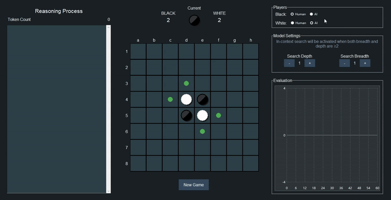
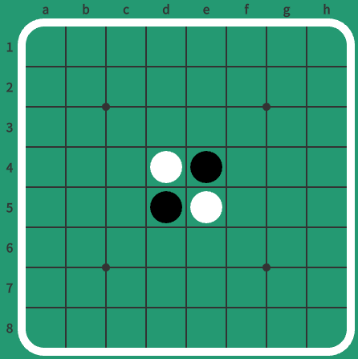
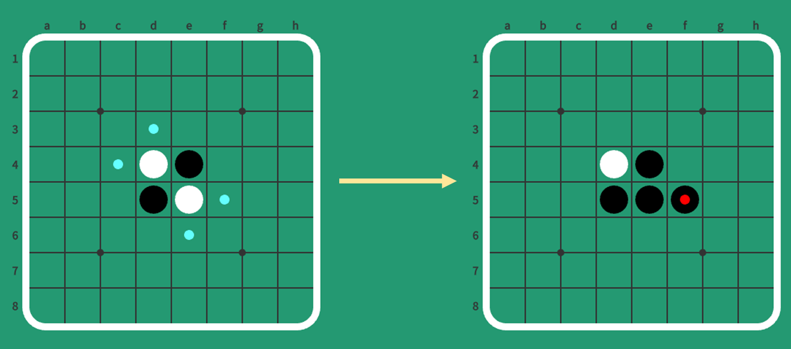
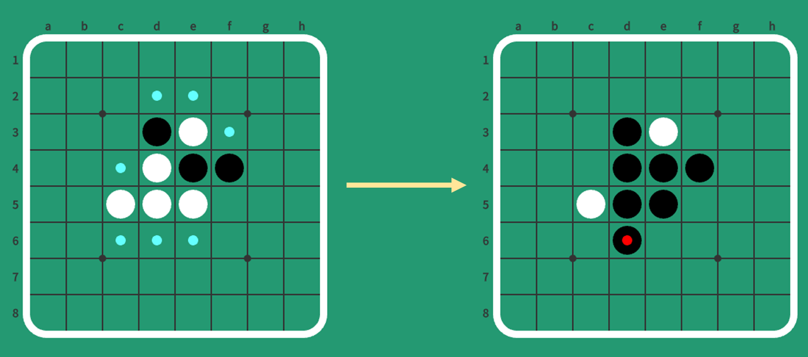
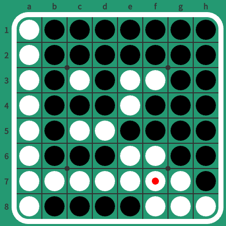
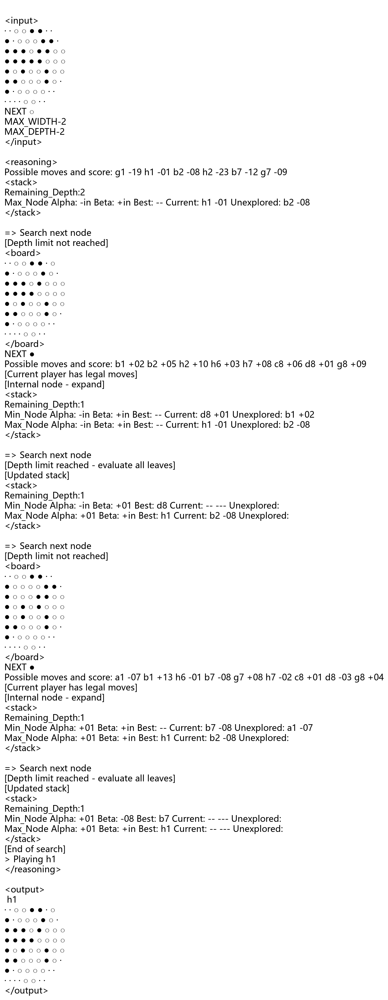
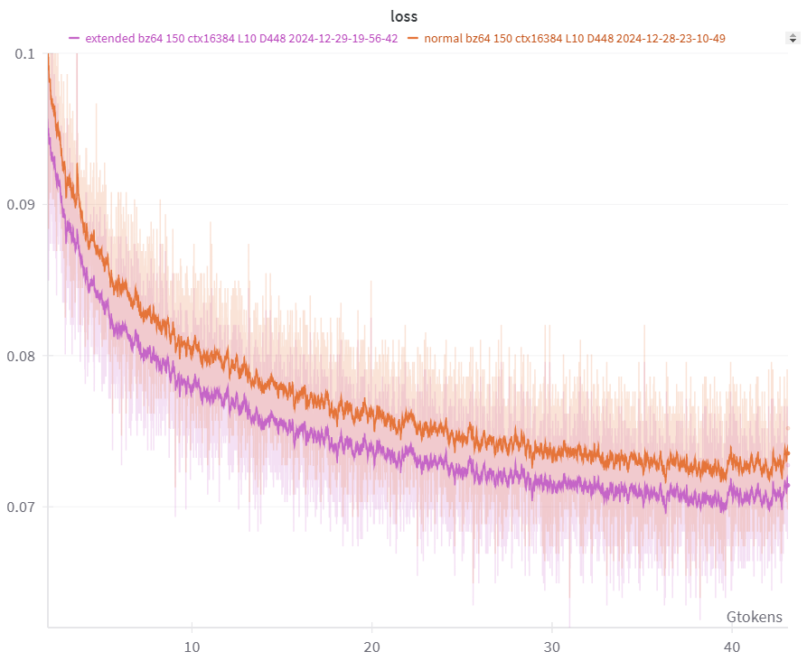
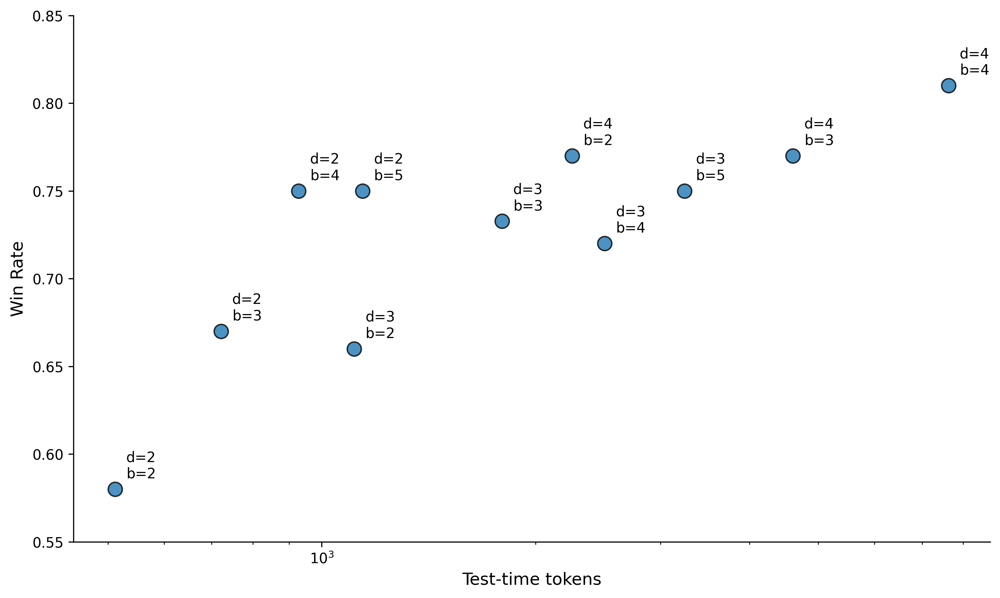
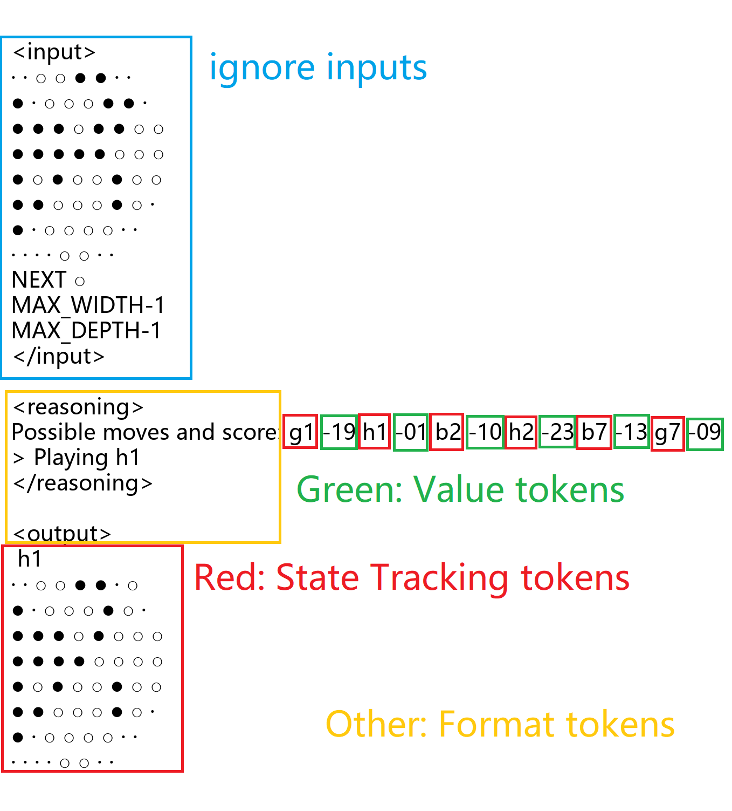
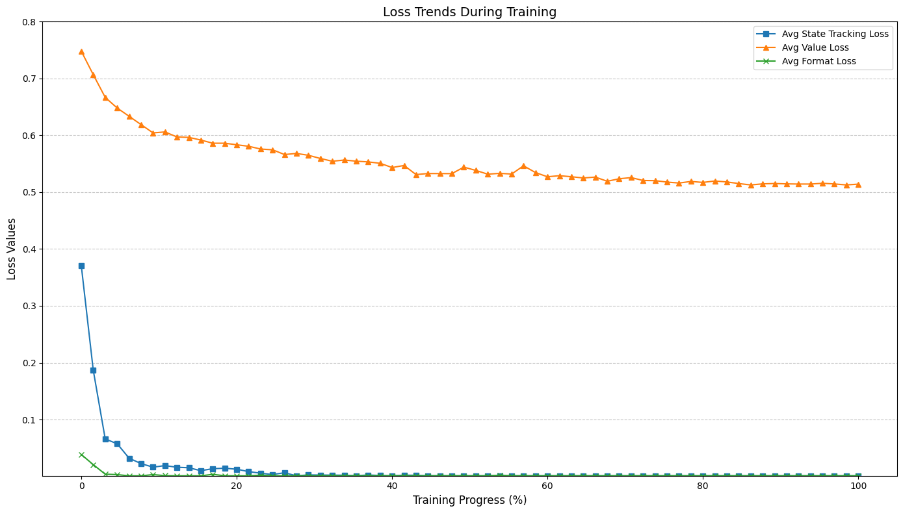

# RWKV-Othello
A specialized RWKV-7 model for Othello(a.k.a. Reversi) that predicts legal moves, evaluates positions, and performs in-context search. Its performance scales with the number of test-time tokens.

   

## Learn how to play Othello/Reversi in 1 minute

1. **Starting Position**: The game always begins with this setup, where Black moves first, followed by alternating turns.

   <!--  -->
   

2. **Making Moves**: A valid move must sandwich opponent's pieces between your newly placed piece and your existing pieces along any line (horizontal, vertical, or diagonal). All sandwiched pieces are then flipped to your color. In the diagram below, blue dots indicate legal moves for Black - placing a black piece on any of these dots will flip the white pieces between it and another black piece.

   <!--  -->
   

   <!--  -->
   

   <!--  -->
   

3. **Winning**: The game ends when the board is full or when neither player can make a legal move. The player with the most pieces on the board wins. In this example, Black wins with 39 pieces to White's 25.

   <!--  -->
   

4. **Your Turn**: Now that you're an Othello expert, why not challenge the model? (I'm still working on my first win against it though 😅)

## Quick Start

### Requirements
torch

rwkv >= 0.8.28

### Run
Run `python ui.py` to interact with the model through a graphical interface

Run `python minimal_inference.py` to execute the minimal implementation of model inference

## Technical Details

### Model

All models in this project are based on the RWKV-7 architecture.

The `models` directory provides pre-trained models in two sizes: 8.8M parameters and 25.7M parameters, with two variants: the original version and a version with extended transition matrix eigenvalues. For the same params, the extended eigenvalue version performs better, which will be discussed later.

Model specifications:

- Architecture: RWKV-7
- Layers: 10
- Hidden dimensions: 256 / 448
- Parameters: 8.8M / 25.7M
- Vocab size: 150

### Data

#### Data Format

A typical training sample looks like this:

<!--  -->

```
<input>
· · ○ ○ ● ● · · 
● · ○ ○ ○ ● ● · 
● ● ● ○ ● ● ○ ○ 
● ● ● ● ● ○ ○ ○ 
● ○ ● ○ ○ ● ○ ○ 
● ● ○ ○ ○ ● ○ · 
● · ○ ○ ○ ○ · · 
· · · · ○ ○ · · 
NEXT ○ 
MAX_WIDTH-2
MAX_DEPTH-2
</input>

<reasoning>
Possible moves and score: g1 -19 h1 -01 b2 -08 h2 -23 b7 -12 g7 -09
<stack>
Remaining_Depth:2
Max_Node Alpha: -in Beta: +in Best: -- Current: h1 -01 Unexplored: b2 -08
</stack>

=> Search next node
[Depth limit not reached]
<board>
· · ○ ○ ● ● · ○ 
● · ○ ○ ○ ● ○ · 
● ● ● ○ ● ○ ○ ○ 
● ● ● ● ○ ○ ○ ○ 
● ○ ● ○ ○ ● ○ ○ 
● ● ○ ○ ○ ● ○ · 
● · ○ ○ ○ ○ · · 
· · · · ○ ○ · · 
</board>
NEXT ● 
Possible moves and score: b1 +02 b2 +05 h2 +10 h6 +03 h7 +08 c8 +06 d8 +01 g8 +09
[Current player has legal moves]
[Internal node - expand]
<stack>
Remaining_Depth:1
Min_Node Alpha: -in Beta: +in Best: -- Current: d8 +01 Unexplored: b1 +02
Max_Node Alpha: -in Beta: +in Best: -- Current: h1 -01 Unexplored: b2 -08
</stack>

=> Search next node
[Depth limit reached - evaluate all leaves]
[Updated stack]
<stack>
Remaining_Depth:1
Min_Node Alpha: -in Beta: +01 Best: d8 Current: -- --- Unexplored:
Max_Node Alpha: +01 Beta: +in Best: h1 Current: b2 -08 Unexplored:
</stack>

=> Search next node
[Depth limit not reached]
<board>
· · ○ ○ ● ● · · 
● ○ ○ ○ ○ ● ● · 
● ○ ○ ○ ● ● ○ ○ 
● ○ ● ○ ● ○ ○ ○ 
● ○ ● ○ ○ ● ○ ○ 
● ● ○ ○ ○ ● ○ · 
● · ○ ○ ○ ○ · · 
· · · · ○ ○ · · 
</board>
NEXT ● 
Possible moves and score: a1 -07 b1 +13 h6 -01 b7 -08 g7 +08 h7 -02 c8 +01 d8 -03 g8 +04
[Current player has legal moves]
[Internal node - expand]
<stack>
Remaining_Depth:1
Min_Node Alpha: +01 Beta: +in Best: -- Current: b7 -08 Unexplored: a1 -07
Max_Node Alpha: +01 Beta: +in Best: h1 Current: b2 -08 Unexplored:
</stack>

=> Search next node
[Depth limit reached - evaluate all leaves]
[Updated stack]
<stack>
Remaining_Depth:1
Min_Node Alpha: +01 Beta: -08 Best: b7 Current: -- --- Unexplored:
Max_Node Alpha: +01 Beta: +in Best: h1 Current: -- --- Unexplored:
</stack>
[End of search]
> Playing h1 
</reasoning>

<output>
 h1 
· · ○ ○ ● ● · ○ 
● · ○ ○ ○ ● ○ · 
● ● ● ○ ● ○ ○ ○ 
● ● ● ● ○ ○ ○ ○ 
● ○ ● ○ ○ ● ○ ○ 
● ● ○ ○ ○ ● ○ · 
● · ○ ○ ○ ○ · · 
· · · · ○ ○ · · 
</output>
```

The sample can be divided into three parts: input section, reasoning section, and output section.

- **Input section**: Captures the game state, including the current board position, active player, and search parameters (tree depth and width settings).
- **Reasoning section**: Varies with search settings:

   - Without search (depth or width = 1): Lists legal moves and their evaluations
   - With search (depth and width > 1): Performs Alpha-Beta pruning to find optimal moves

- **Output section**: Contains the final decision and the resulting board position after the move.

For position evaluation, I used the Egaroucid engine at `level=5` to balance accuracy with generation speed. The final dataset contains 6 million synthetic samples, totaling approximately 43B tokens.

Special thanks to [Takuto Yamana (a.k.a Nyanyan)](https://github.com/Nyanyan), the author of Egaroucid, for their valuable guidance during the data preparation process. 💕

### Training

All models were trained using [RWKV-LM](https://github.com/BlinkDL/RWKV-LM) with the following hyperparameters:

- `M_BSZ`: 64
- `CTX_LEN`: 16384
- `LR`: 12e-4 to 3e-5
- `ADAM_EPS`: 1e-18
- `ADAM_BETA1`: 0.9
- `ADAM_BETA2`: 0.95
- `WEIGHT_DECAY`: 0.01

The loss curves for 26M models are shown below.

<!--  -->


Special thanks to [BlinkDL](https://github.com/BlinkDL) for providing the compute for training! 💕

### Test Time Scaling

The model can perform Alpha-Beta pruning directly in context to explore potential moves and improve decision quality. By increasing the depth and width of the search tree, the model uses more tokens during inference, which leads to better decisions (a.k.a. Test Time Scaling).

To demonstrate test-time-scaling, I compared different search configurations against a baseline model (depth=1, width=1), testing win rates across various tree depths and widths (model: `rwkv7_othello_26m_L10_D448_extended`, each data point contains 100 games).

<!--  -->


As expected, the win rate shows an upward trend as more tokens are used. While the search tree can be scaled much further, I haven't tested larger configurations yet due to the increased inference time required.

### What is the model learning? - Loss Analysis

To understand the model's learning process, I categorized tokens into three types: format tokens, state tracking tokens, and value tokens. 

<!--  -->


I then calculated the loss separately for each token type at each checkpoint on a validation dataset, with results shown below:

<!--  -->


Easy to see that the model first masters output formatting, then develops board state tracking capability, and continuously improves its evaluation accuracy throughout training.

### Extend Eigenvalues

[Recent research](https://arxiv.org/abs/2411.12537) suggests that extending the eigenvalues of linear model transition matrices can enhance state tracking capabilities. Since Othello pieces constantly flip colors, better state tracking could improve model performance.

To test this, I modified the [training code](https://github.com/BlinkDL/RWKV-LM/blob/main/RWKV-v5/src/model.py) as follows (also proivded by [BlinkDL](https://github.com/BlinkDL)):

Line 873:
```python
# a = torch.sigmoid(self.a0 + (xa @ self.a1) @ self.a2)
a = torch.sigmoid(self.a0 + (xa @ self.a1) @ self.a2 ) * 2.0  # extended
```

Line 880:
```python
# x = RUN_CUDA_RWKV7g(r, w, k, v, -kk, kk*a)
x = RUN_CUDA_RWKV7g(r, w, k, v, -kk, kk*(a.float()*torch.exp(-torch.exp(w.float()))).to(dtype=torch.bfloat16))  # extended
```

And the loss curve (purple) proves it works!

### Reproduction
You can reproduce my model with these simple steps:

1. Install the console version of Egaroucid - see instructions [here](https://www.egaroucid.nyanyan.dev/en/console/)(I used v7.4.0 myself).

2. Modify ENGINE_PATH in `generate_data.py` to point to your Egaroucid engine. Other parameters can be adjusted as needed. Run `python generate_data.py` to generate your training data. This will create a jsonl file containing the training samples.

3. Use [RWKV-LM](https://github.com/BlinkDL/RWKV-LM) to convert the jsonl file to binidx format, then start training with the hyperparameters mentioned above. For detailed steps, please follow the guide in RWKV-LM. Good luck!

4. Use `minimal_inference.py` to test your model. You can also use `ui.py` to play against your model through a graphical interface.